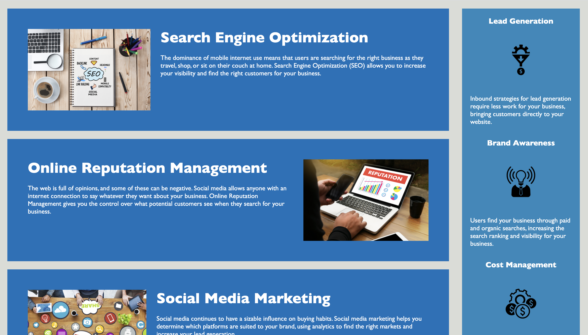
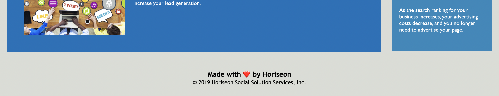

# homework-1
Given Horiseon's existing code, I refactored it to closer meet accessibility standards.

## What Changes Did I Make?
* Added semantic HTML elements.

* Added alt attributes to images.

* Added succinct title.

* Corrected CSS to match new semantic HTML elements.

* Deleted redundant CSS selectors.

* Fixed Search Engine Optimization nav button.

* Organized CSS to follow HTML structure.

* Added comments in CSS.

* Consolidated repetitive CSS code.

## Link to Application
https://laurenlgoss.github.io/homework-1/

## Screenshot of Application

